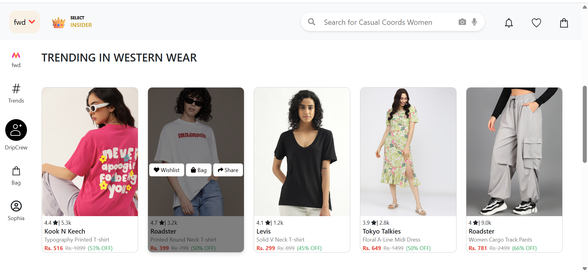
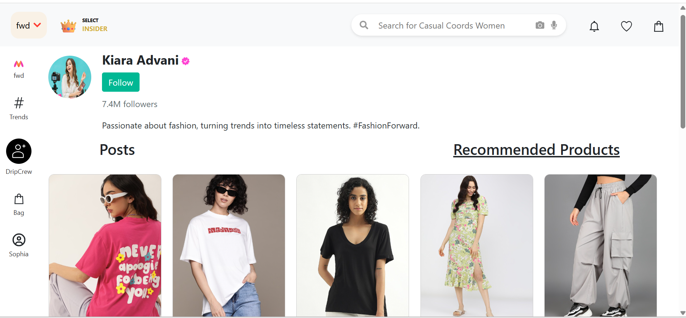

# 🛍️ E-commerce Website with Social Shopping

A modern, mobile-first e-commerce web application that blends traditional shopping features with real-time **social sharing**. Built with the MERN stack, this platform lets users explore products, share them with contacts via chat, and make secure purchases — all in one place.

---

## 🚀 Features

- ✅ Responsive design (mobile-first approach)
- 🔐 Login & user authentication
- 🛒 Product catalogue with shopping cart
- 📤 Product sharing functionality via in-app chat
- 💬 Real-time chat using Socket.io
- ⭐ Follow style icons and see what products they recommend
- 🌐 RESTful APIs for seamless client-server interaction


---

## 🖼️ Website Preview

### 🏠 Home Page



### 💬 Real-time Chat


### ⭐ Style Icons



---

## 🛠️ Tech Stack

| Frontend | Backend | Real-time | Database |
|----------|---------|-----------|----------|
| React    | Node.js | Socket.io | MongoDB  |
| HTML/CSS | Express | REST API  | Mongoose |

---

## 📦 Installation

Clone the repository and install dependencies:

```bash
git clone https://github.com/SafuraAnam/E-commerce-Website.git
cd E-commerce-Website

# Install backend dependencies
cd backend
npm install

# Install frontend dependencies
cd ../frontend
npm install
